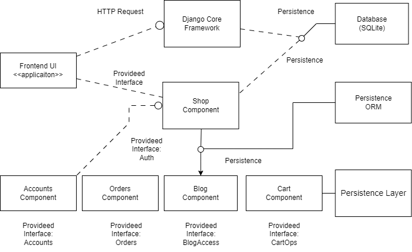
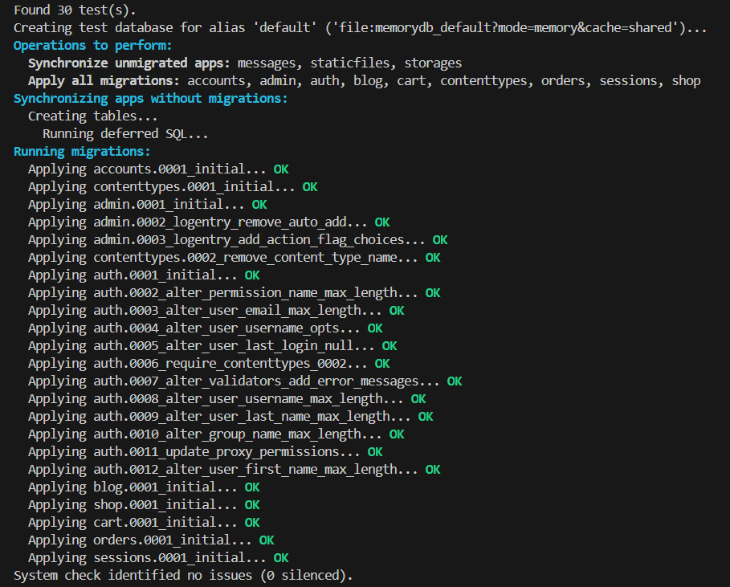
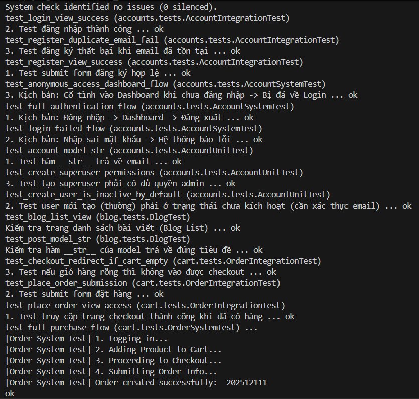
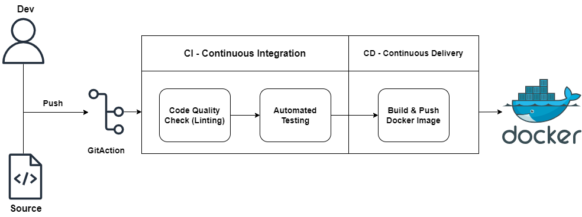
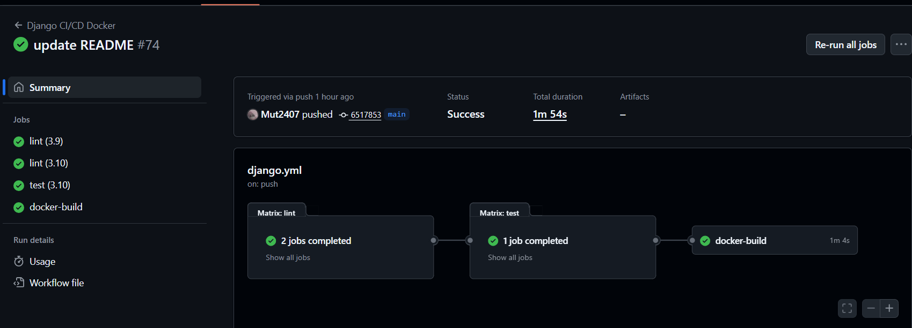

# Cửa hàng thể thao - Sshop.

## 📚 Giới thiệu

**Sshop** là một là một nền tảng **thương mại điện tử (E-commerce)** chuyên kinh doanh đồ thể thao, được xây dựng dựa trên **Django Framework**.

Dự án cung cấp giải pháp bán hàng trực tuyến với các tính năng từ quản lý người dùng, giỏ hàng, tích hợp thanh toán trực tuyến (VNPay) và hệ thống quản trị (Admin Dashboard).

Hệ thống được thiết kế theo mô hình **MTV (Model-Template-View)**, triển khai trên môi trường Local hoặc Container với **Docker**.

## [Videos Demo dự án](https://drive.google.com/drive/folders/139UHoqzkuLbw27rJPYVnP3Rv_lzChh6_?usp=sharing)

---

## 🧩 Kiến Trúc

## 

## Tổng quan

| Category           | Tools / Frameworks               |
| ------------------ | -------------------------------- |
| **Backend**        | Python, Django                   |
| **Frontend**       | HTML5, CSS3, Bootstrap 4, jQuery |
| **Database**       | SQLite (Dev), PostgreSQL (Prod)  |
| **Payment**        | VNPay Gateway, COD               |
| **Infrastructure** | Docker, Docker Compose           |
| **Templating**     | Django Templates (DTL)           |

---

## 📁 Mục Lục

- [Cửa hàng thể thao - Sshop](#-Cửa-hàng-thể-thao - Sshop) \*[]()

## Chức năng chính

<I> User (Khách hàng)

**Authentication**: Đăng ký, Đăng nhập, Xác thực Email, Quên mật khẩu.
**Shopping**: Tìm kiếm sản phẩm, Lọc theo danh mục, Xem chi tiết.
**Cart & Checkout**: Thêm vào giỏ (Ajax), Thanh toán COD hoặc VNPay.
**Profile**: Quản lý thông tin cá nhân, Lịch sử đơn hàng, Đổi mật khẩu.
**Interaction**: Đánh giá và bình luận sản phẩm.

<II> Superuser (Quản trị viên)

**Dashboard**: Thống kê doanh thu, đơn hàng.
**Product Management**: Thêm/Sửa/Xóa sản phẩm, Biến thể (Màu/Size).
**Order Management**: Xử lý trạng thái đơn hàng (New, Accepted, Completed, Cancelled).
**Users & Reviews**: Quản lý tài khoản và kiểm duyệt đánh giá

---

## Môi Trường cài đặt

1. clone this repo

```bash
git clone <this_repo>
```

2. install virtualenv

```bash
pip install virtualenv
```

3. create new virtual environment

```bash
python -m venv venv
```

4. activate the new virtual

```bash
.\venv\Scripts\activate
```

---

## Triển khai Local

1. install requirements.txt

```bash
pip install -r requirements.txt
```

2. Database Migration

```bash
python manage.py migrate
```

3. run local server to begin

```bash
python manage.py runserver
```

4.  go live with [127.0.0.1::8000](http://127.0.0.1:8000/)
    <br>

# To login with superuser and access admin panel

1.  run on terminal

2.  create new admin user
```bash
python manage.py createsuperuser
```

3.  go to [localhost:8000/admin](http://localhost:8000/admin)

---

## 🐳 Docker Setup

1. Build & Run
   ``bash
   docker-compose up -d --build

2. Check Containers

```bash
docker ps
```

# Development

## Tests

## 

## 

## 

---

## CI / CD
## 

## 
